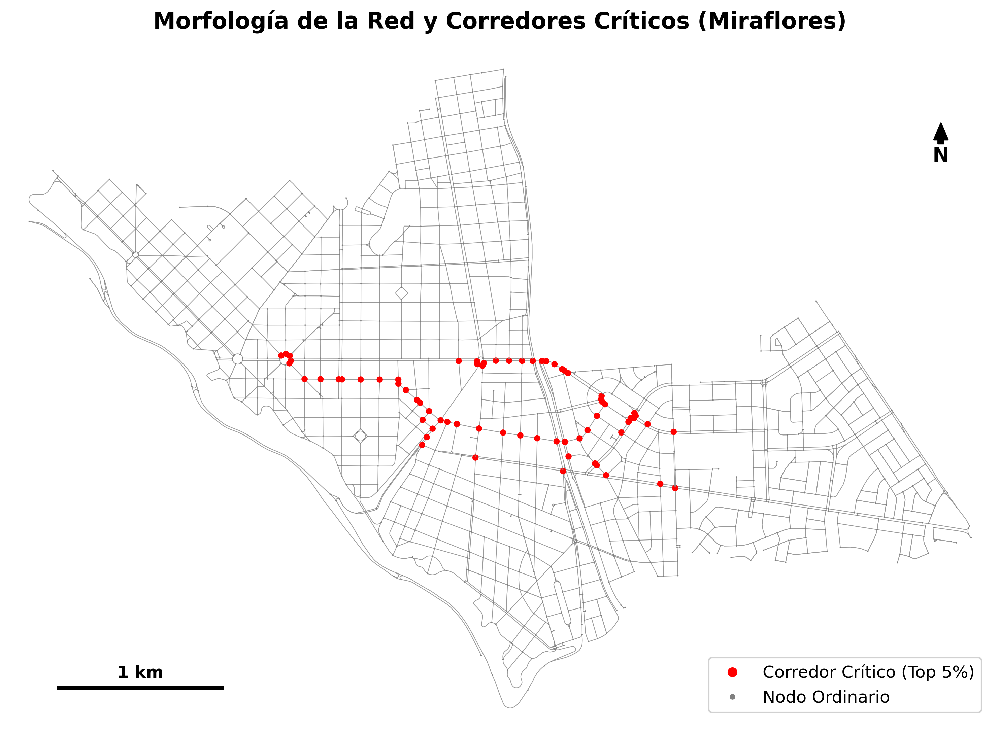
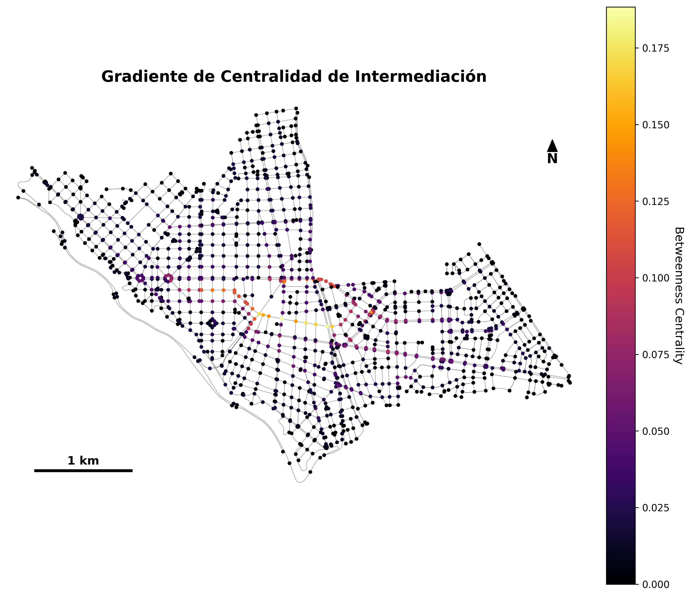
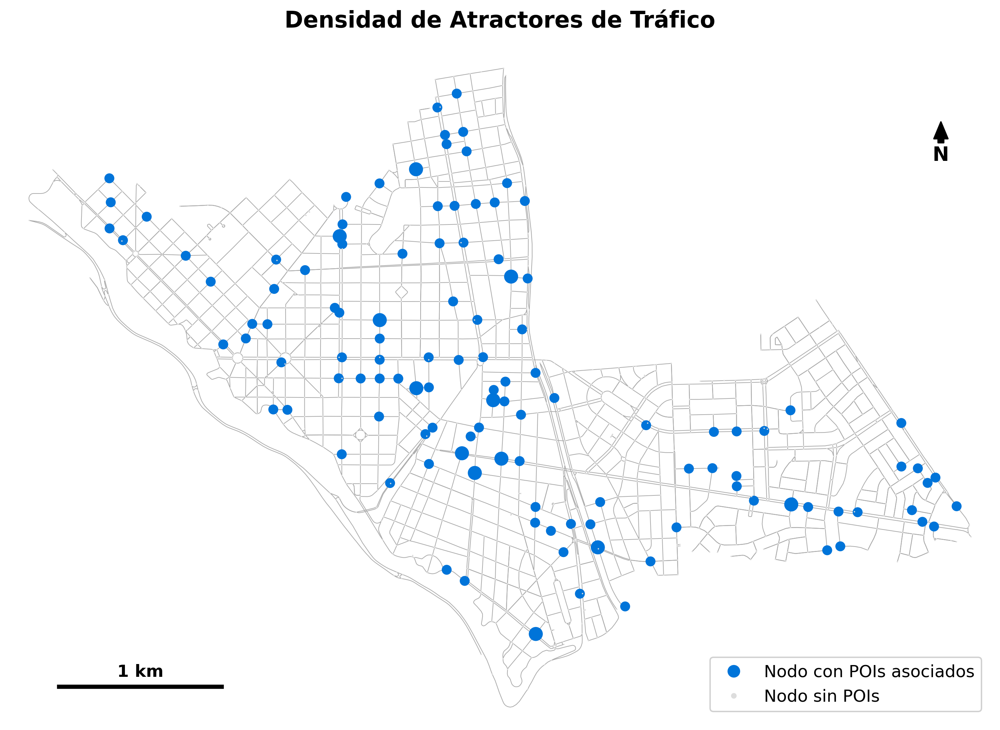

# Hito 1: Trabajo Parcial (EA1) - Complex Networks 2026-2

**Equipo:** Dayana Gomez, Jose Villanueva
**Tema Seleccionado:** 2. Centralidad y corredores críticos de la red vial
**Área de Estudio:** Distrito de Miraflores, Lima Metropolitana, Perú

---

## Resumen
El presente informe expone el avance correspondiente al Hito 1 para el análisis de la red vial vehicular del distrito de Miraflores, Lima, enfocado en identificar corredores críticos mediante métricas de centralidad topológica. Se descargó el grafo de calles a través de OSMnx y se proyectó al sistema CRS EPSG:32718 para cálculos métricos. Adicionalmente, se enriqueció la red con atractores de tráfico (puntos de interés como hospitales y colegios). Los resultados preliminares, apoyados por una sólida cartografía, evidencian cómo el cálculo exacto del *Betweenness Centrality* logra jerarquizar las vías que actúan como "cuellos de botella" o puentes esenciales en la trama urbana.

---

## 1. Introducción y Área de Estudio
La creciente congestión vehicular en metrópolis latinoamericanas exige enfoques analíticos rigurosos. Este proyecto aborda la estructura vial de Miraflores, uno de los nodos comerciales y residenciales más activos de Lima. Hemos delimitado el **network_type='drive'** (vehicular) ya que los corredores críticos, definidos por las reglas de tránsito (`oneway`), impactan directamente al flujo vehicular. El análisis puramente geométrico o visual de la congestión es insuficiente sin un modelo matemático que mida la "intermediación" de cada intersección.

## 2. Metodología y Pipeline de Trabajo
El pipeline metodológico ha sido diseñado para asegurar la total **reproducibilidad** del experimento. Todos los scripts y entornos están versionados con control de dependencias (`requirements.txt`) y una semilla aleatoria fijada (`RANDOM_SEED = 42`).

### 3.1 Adquisición de Datos, Limpieza y Proyección Espacial
Los datos base fueron extraídos de la API Overpass (vía `osmnx == 2.1.1`). 
- **Filtro Geométrico**: Se aplicó explícitamente `simplify=True` para agrupar nodos intermedios que pertenecen al mismo tramo recto, evitando contar curvas como intersecciones.
- **Proyección Métricas**: Previo a todo cálculo, el grafo (en EPSG:4326) fue proyectado al sistema UTM local **EPSG:32718**. 
- **Gestión de Faltantes**: Tras la inspección, se reportó un 18.04% de aristas nulas en `maxspeed`, 17.59% en `lanes` y 4.52% en `name`. Se imputaron las velocidades faltantes en función de la jerarquía de la calle (`highway`), garantizando la preservación del 100% de la conectividad.

### 3.2 Integración Espacial de Atractores (POI)
Se integró una capa complementaria al grafo consistente en Puntos de Interés (POI) altamente atractores de tráfico: hospitales, colegios, universidades y centros comerciales (`amenity`, `shop`). Utilizando la función de vecino más cercano (`ox.distance.nearest_nodes`), los atractores fueron vinculados a la red, agregando el atributo `poi_count` a los nodos.

### 3.3 Análisis Exploratorio y Métricas Globales
Para una comparación justa con otras ciudades, las métricas fueron normalizadas por el área del polígono (9.62 km²). 
- **Grado Medio:** ~3.77 enlaces por nodo (aproximación para red dirigida).
- **Densidad Vial:** ~52 km de vías por km².
- **Densidad de Intersecciones:** ~200 intersecciones por km².
- **Conectividad:** Se validó que más del 90% del sistema pertenece al Componente Gigante (Strongly Connected Component).

### 3.4 Métricas Específicas del Tema: Centralidad
El análisis de corredores críticos se basa en la métrica de **Betweenness Centrality (Intermediación)**. Dado que la red consta de ~2500 nodos, la complejidad de $O(NM)$ no fue un cuello de botella prohibitivo, lo que nos permitió realizar un cálculo analítico **exacto**, descartando la estimación por muestreo heurístico ($k$) y reduciendo el error estadístico a cero. Como factor de ponderación de ruta más corta se usó la distancia física real de la arista (`weight='length'`). 

---

## 4. Resultados Preliminares (Cartografía)

Se generaron los mapas con herramientas estandarizadas, asegurando que todos posean orientación (Norte), una barra de escala (1 km) en el CRS local, y su respectiva leyenda.

### Mapa 1: Morfología y Corredores Críticos
El primer mapa clasifica los nodos de la red, resaltando en rojo el **Top 5%** con mayor intermediación. Estos conforman los principales ejes estructurantes de Miraflores.

### Mapa 2: Gradiente de Intermediación (Heatmap)
Usando una rampa de color continua (*inferno*), se constata cómo los flujos teóricos, si cada intersección enviara rutas más cortas al resto, convergen en grandes troncales, coincidiendo usualmente con avenidas como Pardo o Larco.

### Mapa 3: Integración de Densidad de POIs
La visualización sobrepone el atributo extraído, demostrando que los nodos de alta densidad (color azul y de mayor tamaño) están distribuidos de manera heterogénea en la ciudad, a menudo jalando la carga vehicular hacia ciertas sub-áreas comerciales o de servicios.

